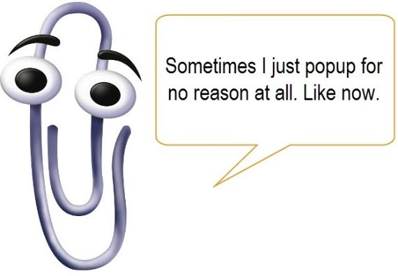

## Clippy
Do you remember that annoying paper clip in Microsoft Office always trying to help you. If not, his name was clippy. He was an automated service that would provide tips and solutions to tasks in Microsoft office. Most would say it was a complete failure, and in 2007 he was scraped by Microsoft. Wouldn't it be amazing to always have an assistant around to help guide you through your tasks. 

## Clippy 2.0
That assistant might not exist for your everyday life. However there is one for coding, <a href="https://eslint.org"> ESLint</a>. ESLint is a code analysis tool that can be incorporated into a IDE such as <a href="https://www.jetbrains.com/idea/"> IntelliJ IDEA</a>. When using ESLint you can take it even further and tell it your preferences on what you expect it to do. That is were the <a href="https://github.com/airbnb/javascript"> Airbnb style guide</a> comes in use. This is the current style guide I am using along side ESLint and IntelliJ IDEA to write Javascript code. 

## Who needs standards
Before I was introduced to ESLint I had to study the standards of coding and hope I caught all my mistakes as I was writing code. Reviewing other classmates code in my early years of school also proved to be quite difficult. If only we both had the same standards as well as a handy assistant to guide us. Coding style standards are a vital part of the coding community. There is no one style for all. Many companies have there own set of standards, but with these standards comes documentation. Having documentation on the style standards allows others to review and learn the standards. Having a set of standards when coding has many great benefits. When working in a large company style standards are a way to allow everyone to understand each others work. Consistent standards in a company provides easy readability when reviewing code. As the age of computers is ever increasing, programs can be in versions way beyond from where they started. Having a standard along with the specific program provides a consistency within the code. Which will provide a framework to understand and update in the future. Keeping up with all these standards can be a difficult task to undertake. That is why we have ESLint to help catch the style standards we seem to forget. With or without the assistant there to help you, no code should be written without a certain standard being followed. 

## Ill take one assistant, please
 What I thought was going to be only a "ABC check", turned into way more. ESLint proved to be more then just a tool to provide readability or consistency in code. ESLint is what clippy always wanted to be. ESLint points out errors not just in the style but also the way the code performs. In a way it keeps tabs on what you are trying to do. If you forget a return or make a variable and forget to use it for something important, it points these things out. This saves valuable time trying to debug a program by preventing the bug in the first place. It has allowed me to improve my code writing substantially. Only after a week of using ESLint along side Airbnb style guide I cant imagine a world without them. 

