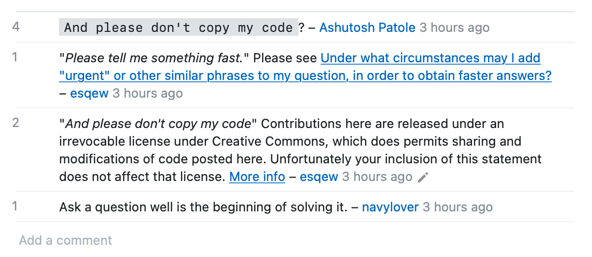

## There’s no stupid questions.

Growing up I always remember hearing teachers say the phrase “no question is dumb”, but as a young smart ass I always remember telling myself, yes there is. Well now thanks to my ICS 314 class I have been introduced to an article by Eric Raymond, <a href="http://www.catb.org/esr/faqs/smart-questions.html"> “How To Ask Questions The Smart Way”</a>, which out lines not only what a stupid question is but also how to ask smart questions. Finally some proof to back me up!

## Woah these things are everywhere.

Finding stupid questions is quite the easy task, here’s one example of a <a href="https://stackoverflow.com/questions/70888975/label-tag-not-visible"> bad question</a>. Right from the get go this question titled “Label tag not visible” begins to break some smart question rules. It does not follow the “object-deviation” format for a good title. The title does not intrigue me to help answer this question. For my purpose of trying to find a bad question I thought, o this is perfect. So upon clicking on the question it turned out to be a great example to share. Below is everything the user included beside the code snippets.  He includes his code with no explanation of the code or where he might assume the code has gone wrong. He then demands to have an answer fast. He is very rude with no question stated, giving more attitude than actually describing the situation, the one he can't solve. 

```
"Hey so recently I was creating navbar which has this code in html file

And this is the CSS code

And the problem is that the label is not visible. 
Please tell me something fast. 
And yes now you are gonna say that I have made it display none 
so in the media queries is says display none. 
And please don't copy my code."⠀

```
Further proof of how this is a terrible question is shown with-in the comments as well. Raymond actually gave examples of these exact responses in his article. Then to top it off someone does actually answer his question, and not a thank you insight.



## Out with the bad, in with the good.

Is it that hard to ask a smart question, they seem to be hard to find. I like this <a href="https://stackoverflow.com/questions/70888344/php-problem-inserting-variables-in-array"> smart question</a>, it covers a few examples outlined by Raymond.  This one starts off a little bit better. The title “(PHP) Problem inserting variables in array” is a bit more in the proper format of  “object-deviation”. This question also includes his code, however he only includes a small snippet of the code where the problem is occurring. He then goes on to explain the goal, which is a characteristic of a smart question. Another positive here is he also gives an example of something he tried to do to fix the problem. Showing that he has actually put some time into trying to solve it on his own. The biggest takeaway that stood out to me was his politeness. He was not only thankful in the question but also after someone responded with two possible fixes. He stated which one worked best for him as well as another “Thanks”

```

"I'm having trouble inserting variables in an array. This is the array:

What I need to be able to do is to replace the card_number, exp_month, 
exp_year, and so on with user submitted values. 
I have tried many ways to replace the values like this one:

Unfortunately, the variables aren't being read. 
Any help is appreciated. Thanks."

``` 
## The important parts.

After reading Raymonds article you really get the feel for his animosity towards stupid questions. Which I completely understand, however in my opinion there is a middle ground. Stupid questions should never be aloud to be posted. Upon my search for a smart question I realized that even if a question does not conform to all of the rules he has meticulously outlined it can still be a good question. Three of the most important parts I believe should always be followed are as follows. One, courtesy is the most important. Be polite, use please and thank you, something which I thought everyone learned in grade school. Second, a good title. If you want someone to answer your question you need them to click on the question. Make it clear and to the point with the “object-deviation” format. Third, be clear about the issue and what you are trying to accomplish, not what you think needs to happen. 

## He’s not wrong.

However much animosity he has towards stupid questions, hes not wrong. If you do follow his guide down to the very last step, you should always get an answer to your question or incite a very powerful discussion. This is very important for becoming a smart software engineer. When asking smart questions it helps develop a better way of communicating. With clear communication it tends to lead to better learning leading to better written code. 


