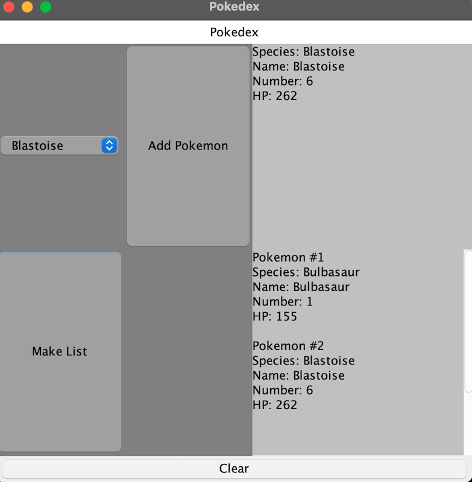

  This project is one I'll remember forever. ICS 111 was my very first programming class; prior to this class I had never been exposed to any kind of coding. I'm not even sure I entirely knew what it was either. ICS 111 was and intro class to java. We spent the entire semester learning mostly basics. The first half of the semester assignments were mostly independent of each other. As the second half began we started to build programs on top of each other, the next one needed the previous one to operate. This was leading up to the finale project.

  As the final project we combined all the individual java programs and turned it into a GUI (graphic user interface) , a sort of basic pokedex. What seems simple on the face, has many operations going on in the background. Using all the methods, classes, and exceptions we learned during the semester we created Pokemon objects. Each pokemon has a set of characteristics and is given a random HP (hit points) each time one is added to the pokedex. There are buttons to add Pokemon to the pokedex as well as printing out a list of the pokemon already added to the pokedex.

  With this final project the new aspect of a GUI was introduced, I was not a fan. This project was fun and introduced me to what game development would be like. The final project showed me I did not want to go into the field of game development. This part of computer science was not of interest to me. This led me into searching what else was out there and led me to Data Science. Data Science caught my eye and I haven't looked away since.

Source: <a href="https://github.com/glevy94/PokemonGUI"><i class="large github icon"></i>glevy94/PokemonGUI</a>
