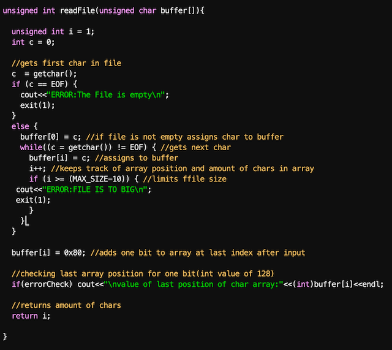

I took ICS 212 in my Spring semester of 2021. ICS 212 was a C/C++ class taught at Kapiolani Community College. In this class we learned how to code C using a terminal through a server at the University of Hawaii. For the final project of the semester we had a coding assignment assigned to us that involved many aspects of the entire semester bundled into one. However we also had to learn about SHA-1, which is a cryptographic hash function. We had an entire month to complete this project and every minute was necessary.

SHA-1 is an outdated hash function that was used to make digital information confidential. The hash function computes a message digest which is unique to every file. No matter how similar the files are, the message digest will be completely different. This is used to verify a file has not been corrupted by someone else. SHA-1 has become outdated because it has been proven possible to create this unique message digest with two different files. 

This project provided me with a lot of problem solving skills. I ran into many problems, mostly with reading in a file. Then after reading in the file I had to convert it into a different format to be able to run it with the hash function. I learned how to debug my code bit by bit in order to solve and find my mistakes within the code. Even though SHA-1 is becoming obsolete so the use of this function is not necessary, the problem solving skills I gained are worth way more!

 
Source: <a href="https://github.com/glevy94/sha-1"><i class="large github icon"></i>glevy94/sha-1</a>
