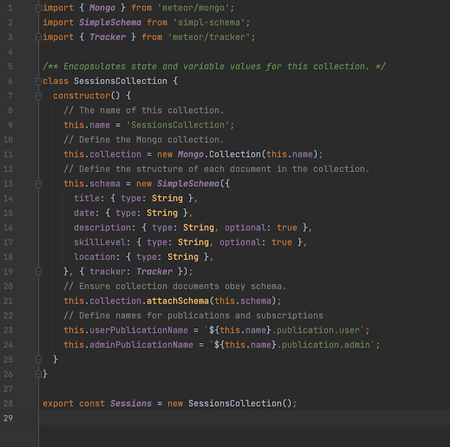

Fitness Finder is a web based application to link with other UH community members and explore workout sessions. This was my first experience with a full stack project. It involved using mongo database for the back end, meteor and react for the front end. Together three other classmates and I used GitHub to build Fitness Finder. We implemented a style of Agile Project Management called Issue Driven Project Management or for short IDPM. Which helped us build the web app at a consistent pace.

Some guidelines to implementing IDPM include. Meeting twice a week, splitting up tasks into 72 hour chunks, keeping documentation of such tasks, assigning each task to a team member. Then grouping theses tasks into 7-10 day "milestones" which could be presented to a client. This process can be easily implemented using GitHub Project. These project management tools made working with others a lot easier then I have experienced in the past and will be something I use moving forward for all my projects.

In this project I contributed to a few front end pages but most of my work was focused on the back end. I was responsible for creating the schemas, and the database layout for storing and accessing the information in the web app. Previewed below you can see the schema for the sessions collection. Along with the schema there are various methods involved to add or change the information within the collections.

This has to be the most valuable project I have completed to date it taught me so many things that can be implemented throughout my computer science career. It thought me basics such as team work and how to step up as a leader. It showed me the full scale development of a project allowing me to imagine how huge application projects go through there day by day development. As well as introducing me to all the levels of development allowing me to focus in on a particular level to further my development as I make my way into the workforce in the coming years.

 
Project home page can be accessed through GitHub <a href="https://fitness-finder.github.io/"><i class="large github icon"></i>fitness-finder.github.io</a>.
